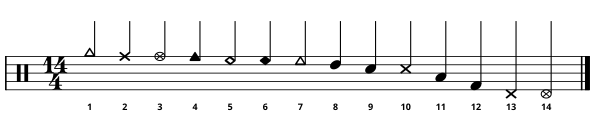
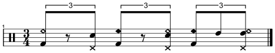
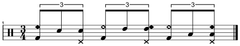
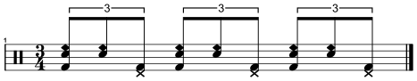
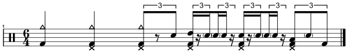
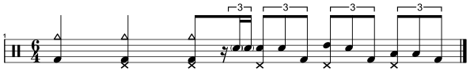
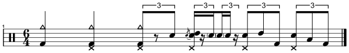
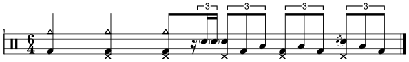
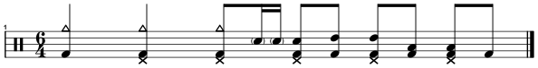
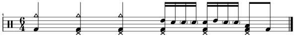

# Jimi Hendrix | 'Manic Depression'
<table>
  <tbody>
    <tr>
      <td align="right"><strong>Album</strong></td> 
      <td>Are You Experienced (1967)</td>
    </tr>
    <tr>
      <td align="right"><strong>Audio</strong></td>
      <td>
        <a href="https://open.spotify.com/track/3f5JtAsGRIXN8pSAeTi6vA?si=d1e190a357794291">Spotify</a>
        /
        <a href="https://www.youtube.com/watch?v=_OmzEQzaaU4&list=RD_OmzEQzaaU4&start_radio=1">YouTube</a>
      </td>
    </tr>
    <tr>
      <td align="right"><strong>Tempo</strong></td>
      <td>♩= 148 BPM</td>
    </tr>
  </tbody>
</table>

<!-- NOTE LEGEND -->

Note legend

 

  

<table align="center">
  <thead>
    <tr>
      <th align="center">No.</th>
      <th align="left">Note</th>
      <th align="center">No.</th>
      <th align="left">Note</th>
      <th align="center">No.</th>
      <th align="left">Note</th>
    </tr>
  </thead>
  <tbody>
    <tr>
      <td align="center">1</td>
      <td>Crash</td>
      <td align="center">6</td>
      <td>Ride (bell)</td>
      <td align="center">11</td>
      <td>Tom (floor)</td>
    </tr>
    <tr>
      <td align="center">2</td>
      <td>Hi-hat (closed)</td>
      <td align="center">7</td>
      <td>Ride (crash)</td>
      <td align="center">12</td>
      <td>Kick</td>
    </tr>
    <tr>
      <td align="center">3</td>
      <td>Hi-hat (open)</td>
      <td align="center">8</td>
      <td>Tom (rack)</td>
      <td align="center">13</td>
      <td>Hi-hat foot (closed)</td>
    </tr>
    <tr>
      <td align="center">4</td>
      <td>Cowbell</td>
      <td align="center">9</td>
      <td>Snare</td>
      <td align="center">14</td>
      <td>Hi-hat foot (splashed)</td>
    </tr>
    <tr>
      <td align="center">5</td>
      <td>Ride (bow)</td>
      <td align="center">10</td>
      <td>Crosstick</td>
      <td></td>
      <td></td>
    </tr>
  </tbody>
</table>

 
<!-- NOTE LEGEND -->

  

  

 
 
 

  

  

 
 
 

  

 
 
 

  

 
 
 

  

 
 
 

  

 
 
 

  

 
 
 

  

 
 
 

  

