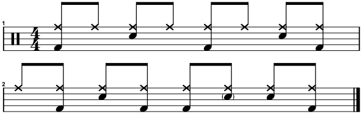
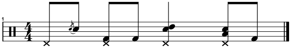
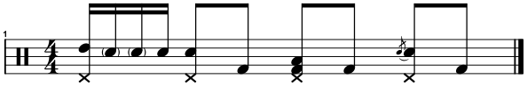
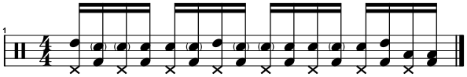
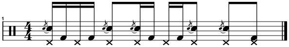

# Led Zeppelin | 'Misty Mountain Hop'
<table>
  <tbody>
    <tr>
      <td align="right"><strong>Album</strong></td>
      <td>Led Zeppelin IV (1971)</td>
    </tr>
    <tr>
      <td align="right"><strong>Audio</strong></td>
      <td>
        <a href="https://open.spotify.com/track/3frf3zTgzt3YIx9ylpUoqU?si=b42fb1991be7484b">Spotify</a>
        /
        <a href="https://www.youtube.com/watch?v=y6M3YQ_EF2E&list=RDy6M3YQ_EF2E&start_radio=1">YouTube</a>
      </td>
    </tr>
    <tr>
      <td align="right"><strong>Tempo</strong></td>
      <td>♩= 133 BPM</td>
    </tr>
  </tbody>
</table>

  

  

 
 
 

  

  

 
 
 

  

 
 
 

  

 
 
 

  

